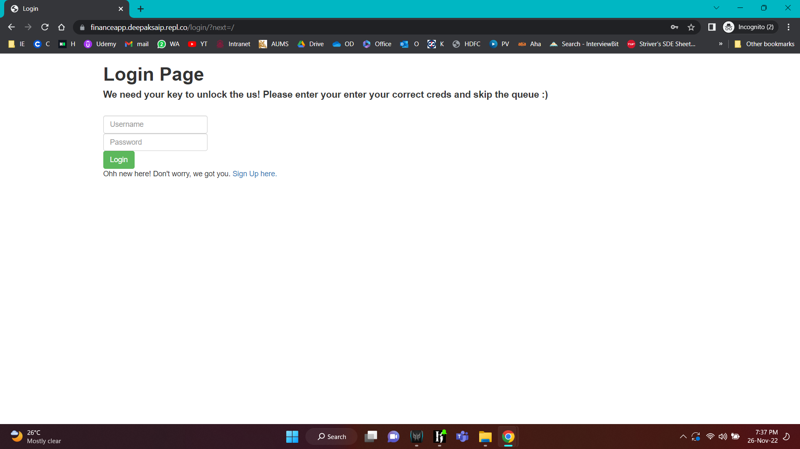
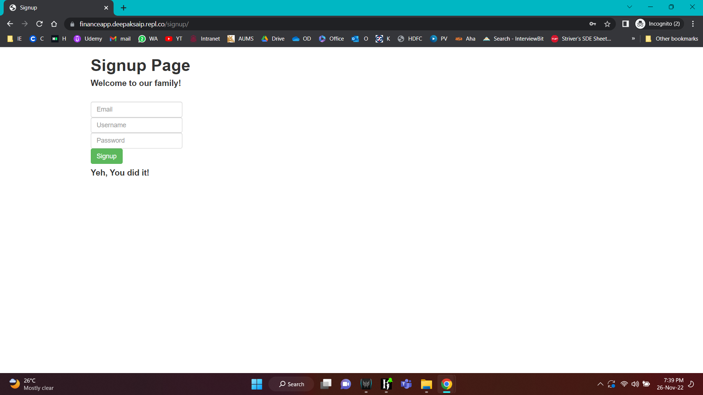
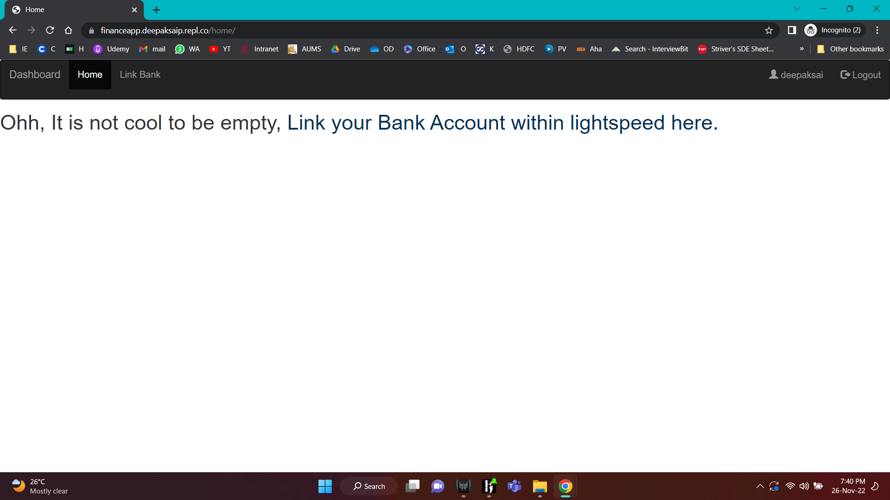
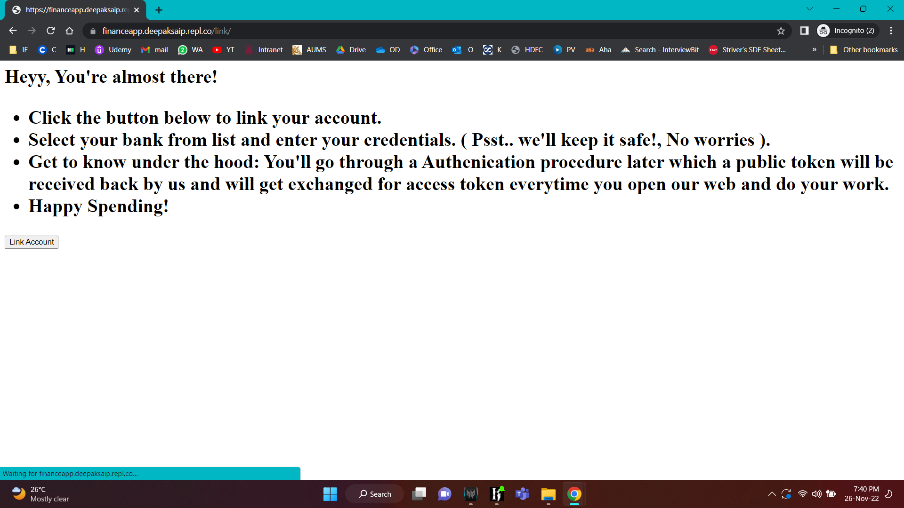

# Finance App with Plaid and Django Rest Framework

# BrightMoney Assignment

[Plaid](https://plaid.com/docs/) is an account aggregation service where users can login with their bank credentials and plaid fetches last two years of transaction and account balance data for their bank account.

● Item, a set of credentials (map of key value pairs) associated with a financial institution
and a user.
○ Users can have multiple Items for multiple financial institutions.
● Each Item can have many associated accounts, which hold information such as balance,
name, and account type


## Demo:





## Commands to run the app
- ``` $ python -m pip install -r requirements.txt ```
- ``` $ source ./env/bin/activate ```
- ``` $ redis-server ```
- ``` $ celery -A plaid_django worker -l info```
-  ``` $ python manage.py runserver 0.0.0.0:3000 ```

## Steps Integrating With Plaid
1. Get the client id, public key and sandbox/development secret.
2. Choose the appropriate endpoint:
a. https://sandbox.plaid.com (Sandbox)
b. https://development.plaid.com (Development)
c. https://production.plaid.com (Production)
3. Plaid offers following products :
a. Auth : POST /auth/get
i. Set up ACH transfers from banks / credit unions in US
ii. Linking via banking credentials allows immediate ACH setup
iii. Linking via microdeposits take 1-2 days (uses same day ACH for deposits)
b. Transactions : POST /transactions/get
i.
c. Identity : POST /identity/get
i. Verify user’s identity against bank details
ii. Collect names, phonno, addresses and emails for each account
d. Income : POST /income/get
e. Balance : POST /accounts/balance/get
i. Return funds in account realtime
ii. Reduce overdraft fees and enable account pre
f. Assets : POST /assets/get